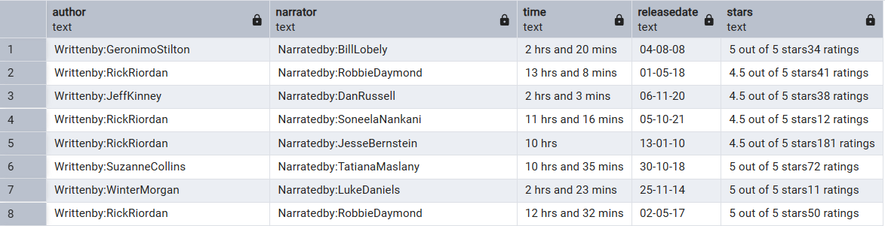
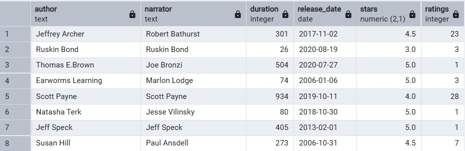

[](LICENSE)
[](https://github.com/Farshid89/audible-cleaning-postgres/stargazers)
[](https://github.com/Farshid89/audible-cleaning-postgres/issues)
[](https://makeapullrequest.com)
[](https://www.postgresql.org/)
[](#)

# Audible Dataset Cleaning (PostgreSQL)

Production‑minded SQL cleaning pipeline, based on your original work with minimal, safe fixes and clearer comments.  
Main script: `audibles_cleaning_ready.sql` (transaction‑wrapped).

## Highlights
- Staging workflow that leaves raw data untouched
- `author` / `narrator`: remove prefixes, space camelCase
- `duration` → **total minutes (INT)** (handles “Less than a minute”)
- `stars` → **DECIMAL(2,1)** and `ratings` → **INTEGER** (`ratings?` supports both “rating” and “ratings”)
- `release_date` → **DATE**; `price` cleaned and → **DECIMAL(10,2)**
- Uses `regexp_match` (singular) in `UPDATE` statements to avoid SRF errors

## Quickstart (with samples)
```bash
psql -d your_db
\i sample_load.sql
```

## Files
- `audibles_cleaning_ready.sql` – main pipeline (your logic + comments)
- `schema.sql` – raw text‑first table for loading CSVs
- `sample_load.sql` – demo: load sample + run pipeline
- `data/audible_uncleaned_sample.csv` – 30 rows for quick tests (87489 rows, 8 columns in full file)
- `data/audible_cleaned_sample.csv` – 30 rows from your cleaned file (87489 rows, 9 columns in full file)
- `LICENSE` – MIT
- `.gitignore` – keeps large data out by default

## Regex note
Use `ratings?` so it matches both **“1 rating”** and **“126 ratings”**:
```sql
(regexp_match(stars, '(?i)([0-9]+)\s*ratings?\b'))[1]
```

## NULL handling
```sql
-- safe casts on blanks
NULLIF(stars,'')::DECIMAL(2,1)

-- default regex miss to 0
COALESCE((regexp_match(duration, '([0-9]+)\s*(min|mins)'))[1]::int, 0)
```
## Before / After (sample)

**Before – Raw CSV** (first 10 rows)



**After – Cleaned Output** (first 10 rows)



> Visual checkpoints:
> - `time` → `duration` (minutes)
> - `releasedate` → `release_date` (DATE)
> - `stars` text → numeric `stars` and `ratings`
> - `author`/`narrator` prefixes removed + camelCase spaced
